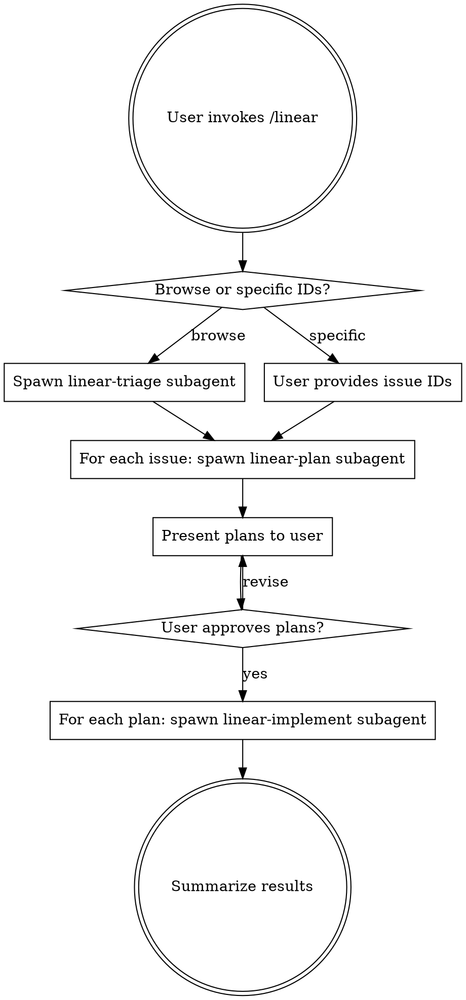

# Linear Issue Workflow

## Overview

Orchestrate Linear issue workflows: browse your backlog, pick issues, create implementation plans, and execute them — all while keeping your main context clean via subagents.

## Prerequisites

- `LINEAR_API_KEY` environment variable must be set
- Get your key at: Linear Settings → API → Create Key
- `export LINEAR_API_KEY="lin_api_..."`

## API Script

All Linear API calls go through:

```bash
bun ~/.claude/skills/linear/scripts/linear-api.ts <command>
```

Commands:
- `list-teams` — discover teams
- `list-states --team KEY` — workflow states for a team
- `list-issues --team KEY --status NAME --assignee NAME --label NAME --limit N`
- `get-issue IDENTIFIER` — full issue details (e.g., BLU-42)
- `search-issues <query>` — full-text search
- `create-issue --title T --team KEY --description D --priority 0-4 --label L`
- `update-status IDENTIFIER "State Name"`
- `add-comment IDENTIFIER "comment body"`

## Workflow



### Step 1: Determine Scope

Ask the user:
- **Browse backlog**: "Let me look through your issues and help you pick" → Spawn a **linear-triage** subagent
- **Specific issues**: User provides issue IDs (e.g., "BLU-42, BLU-57") → Skip to Step 2

### Step 2: Plan

For each selected issue, spawn a **linear-plan** subagent using the Task tool:

```
Task tool:
  subagent_type: general-purpose
  prompt: |
    You are a Linear planning agent. Read and follow the skill instructions at:
    ~/.claude/skills/linear/linear-plan/SKILL.md

    Issue to plan: <IDENTIFIER>
    Project root: <current working directory>

    The Linear API script is at: ~/.claude/skills/linear/scripts/linear-api.ts
    Run it with: bun ~/.claude/skills/linear/scripts/linear-api.ts <command>
```

**Parallelism decision:**
- Independent issues (different areas of codebase) → spawn plan subagents **in parallel**
- Overlapping issues (same files/modules) → run **serially**
- Ask the user if unsure

### Step 3: Review Plans

Present each plan summary to the user. Wait for explicit approval before proceeding.

### Step 4: Implement

For each approved plan, spawn a **linear-implement** subagent using the Task tool:

```
Task tool:
  subagent_type: general-purpose
  prompt: |
    You are a Linear implementation agent. Read and follow the skill instructions at:
    ~/.claude/skills/linear/linear-implement/SKILL.md

    Issue: <IDENTIFIER>
    Plan:
    <paste the full plan here>

    Project root: <current working directory>

    The Linear API script is at: ~/.claude/skills/linear/scripts/linear-api.ts
    Run it with: bun ~/.claude/skills/linear/scripts/linear-api.ts <command>
```

Same parallelism rules as Step 2. Consider using git worktrees for parallel implementations.

### Step 5: Summary

After all subagents complete:
- Summarize what was implemented
- List any follow-up issues created
- Report any failures or blockers

## Context Strategy

**The orchestrator (you) should hold minimal context:**
- Issue identifiers and one-line summaries only
- Delegate all codebase exploration to subagents
- Delegate all code writing to subagents
- Only hold plan summaries (not full plans) after Step 2

This keeps the main context clean for processing many issues in one session.

## Important

- Always confirm with the user before changing issue status in Linear
- Never auto-close issues — let the user decide when to mark done
- If a subagent encounters blockers, surface them to the user immediately
- Announce write operations (create issue, update status, add comment) before executing them
